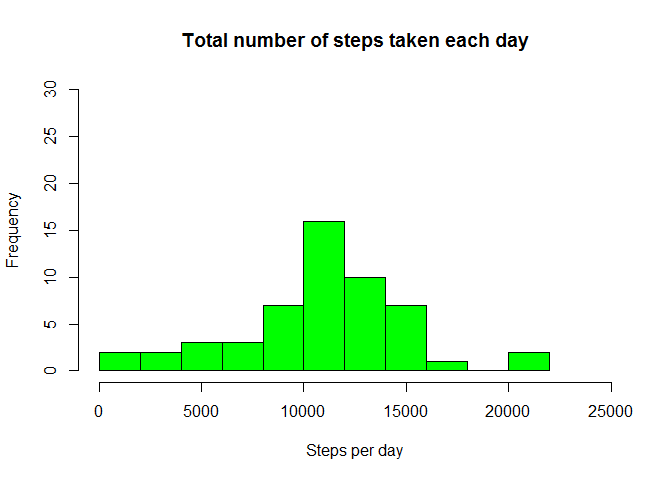
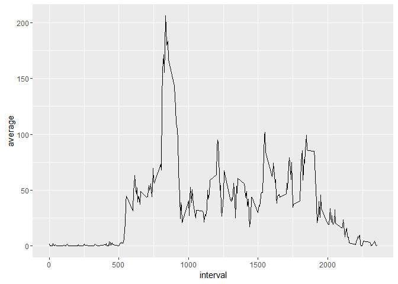
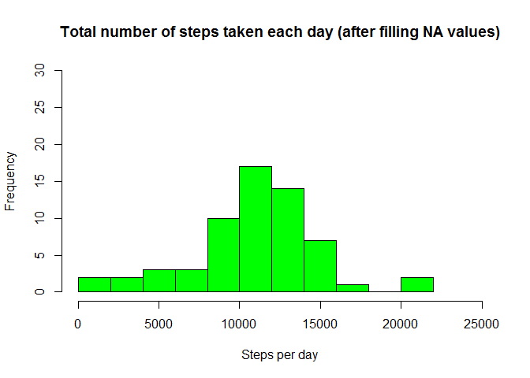
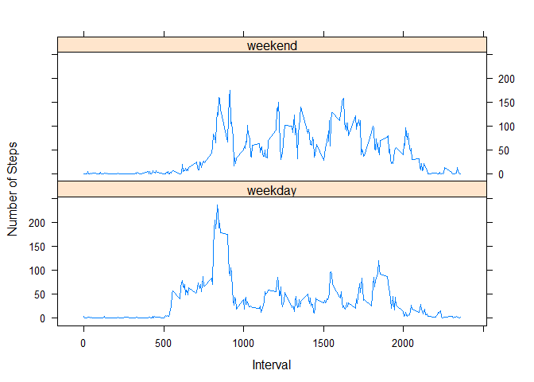

# Reproducible Research: Peer Assessment 1


## Loading and preprocessing the data
In this section we will unzip the file "activity.zip" and load it in the "act" data frame. Then we transform the "date" column of data frame in a date format.

```r
# unzip and load the data
unzip("activity.zip")
act<-read.csv("activity.csv")
# change date format
act$date <- as.Date(act$date)
str(act)
```

```
## 'data.frame':	17568 obs. of  3 variables:
##  $ steps   : int  NA NA NA NA NA NA NA NA NA NA ...
##  $ date    : Date, format: "2012-10-01" "2012-10-01" ...
##  $ interval: int  0 5 10 15 20 25 30 35 40 45 ...
```

```
## [1] "in the 'act' dataframe there are 17568 rows. 2304 rows contains NA values for column 'steps'."
```


## What is mean total number of steps taken per day?
For this part of the assignment, we can ignore the missing values in the dataset.We calculate the total number of steps taken per day and plot an histogram as requested. Then calculate the mean and the median values of total number of steps taken per day.

```r
# Calculate the total number of steps taken per day
totStPerDay<-tapply(act$steps,act$date,sum)

# Make a histogram of the total number of steps taken each day
hist(totStPerDay, breaks=10, main="Total number of steps taken each day", xlab="Steps per day", col="green",xlim=c(0,25000),ylim=c(0,30))
```



```r
# Calculate the mean and the median of the total number of steps taken per day
meanStPerDay <- mean(totStPerDay,na.rm=TRUE)
print(paste("mean of the total number of steps taken per day: ", round(meanStPerDay,digits=2)))
```

```
## [1] "mean of the total number of steps taken per day:  10766.19"
```

```r
medStPerDay <- median(totStPerDay,na.rm=TRUE)
print(paste("median of the total number of steps taken per day: ",medStPerDay))
```

```
## [1] "median of the total number of steps taken per day:  10765"
```


## What is the average daily activity pattern?
In this section we will make a time series plot of the 5-minute interval (x-axis) and the average number of steps taken, averaged across all days (y-axis). Then we will found the 5-minute interval that containse the maximum number of steps (on average).

```r
library(ggplot2)
library(plyr)
# calculate the average daily steps per interval
aveStPerInt<-ddply(act,.(interval),summarize,average=mean(steps,na.rm=TRUE))
head(aveStPerInt)
```

```
##   interval   average
## 1        0 1.7169811
## 2        5 0.3396226
## 3       10 0.1320755
## 4       15 0.1509434
## 5       20 0.0754717
## 6       25 2.0943396
```

```r
# Make a time series plot 
p <- ggplot(aveStPerInt,aes(interval, average))+geom_line()
print(p)
```



```r
# Which 5-minute interval contains the maximum number of steps?
maxStepsInt <- aveStPerInt[aveStPerInt$average == max(aveStPerInt$average),1]
print(paste("the max number of steps is in the interval num.",maxStepsInt))
```

```
## [1] "the max number of steps is in the interval num. 835"
```

## Imputing missing values
Note that there are a number of days/intervals where there are missing values (coded as NA). The presence of missing days may introduce bias into some calculations or summaries of the data.
For filling the missing values in the dataset we will use the mean of step of the same interval in the same weekday.

```r
# Calculate and report the total number of missing values in the dataset (i.e. the total number of rows with NAs)
totNaVal <- nrow(act[is.na(act$steps),])
print (paste("In the dataset there are",totNaVal,"missing values"))
```

```
## [1] "In the dataset there are 2304 missing values"
```

```r
# Devise a strategy for filling in all of the missing values in the dataset. 
# Our strategy: substitute the missing steps with the average interval on the same weekday

act$wday <- weekdays(as.Date(act$date))
aveStPerIntWd<-ddply(act,.(wday,interval),summarize,ave=mean(steps,na.rm = TRUE))

actNA <- act[is.na(act$steps),]
newdata<-merge(actNA, aveStPerIntWd, by=c("interval", "wday"))

names(newdata)
```

```
## [1] "interval" "wday"     "steps"    "date"     "ave"
```

```r
## Create a new dataset that is equal to the original dataset but with the missing data filled in.
act2<-act[!is.na(act$steps),]
act2<-act2[,-4]
act3<-newdata[,c(5,4,1)]
names(act3)<-names(act2)
act4<-rbind(act2,act3)
```
The new dataset is 'act4' and have the same number of rows of original dataset.

```
## [1] "nrow of 'act' = 17568  nrow of 'act4' =  17568"
```
Now we make a histogram of the total number of steps taken each day and Calculate and report the mean and median total number of steps taken per day.

```r
# Calculate the total number of steps taken per day
totStPerDay4<-tapply(act4$steps,act4$date,sum)

# Make a histogram of the total number of steps taken each day
hist(totStPerDay4, breaks=10, main="Total number of steps taken each day (after filling NA values)", xlab="Steps per day", col="green",xlim=c(0,25000),ylim=c(0,30))
```



```r
# Calculate the mean and the median of the total number of steps taken per day
meanStPerDay4 <- mean(totStPerDay4,na.rm=TRUE)
print(paste("mean of the total number of steps taken per day: ", round(meanStPerDay4,digits=2)))
```

```
## [1] "mean of the total number of steps taken per day:  10821.21"
```

```r
medStPerDay4 <- median(totStPerDay4,na.rm=TRUE)
print(paste("median of the total number of steps taken per day: ",medStPerDay4))
```

```
## [1] "median of the total number of steps taken per day:  11015"
```

The assignment requires us if these values differ from the estimates from the first part of the assignment. Then we evaluate what is the impact of imputing missing data on the estimates of the total daily number of steps.

```
## [1] "difference from imputing missing data:"
```

```
## [1] "mean: (with NA) 10766.19 (without NA) 10821.21 (diff) 55.02 (%) 0.51"
```

```
## [1] "median: (with NA) 10765 (without NA) 11015 (diff) 250 (%) 2.32"
```

## Are there differences in activity patterns between weekdays and weekends?
For this part of assignment we will use the dataset with the filled-in missing values. We create a new factor variable in the dataset with two levels "weekday" and "weekend" indicating wheter a given date is a weekday or weekend day.
Using this factor we will make a panel plot like the example contained in GitHub repository.


```r
# note that my PC has the language setted to Italian
Sys.setlocale("LC_TIME", "English")
```

```
## [1] "English_United States.1252"
```

```r
# Create a new factor variable 
act5<-act4
act5$wday<-weekdays(as.Date(act5$date))

act5$flwend <- as.factor(ifelse(weekdays(as.Date(act5$date)) %in% c("Saturday","Sunday"),"weekend","weekday"))

# Make a panel plot containing a time series plot
acttab <- ddply(act5, .(interval, flwend), summarize, ave = mean(steps,na.rm=TRUE))
library (lattice)
xyplot(ave~interval|flwend, data=acttab, type="l",  layout = c(1,2),
        ylab="Number of Steps", xlab="Interval")
```


The plot shows that the global activity of the  subject is more frequent but less intensive during weekend.
